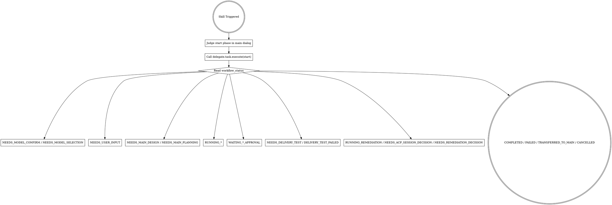

# Team Delegate

将委派流程交给插件状态机。模型只负责理解需求与对话；流程推进由 `delegate.task.execute` 驱动。

<HARD-GATE>
在进入委派编码前，必须先完成“主对话阶段判定 + 开发类型判定 -> start 入场”闭环。禁止做以下动作：
1. 未完成阶段判定和开发类型判定就直接调用 `delegate.task.execute(action=start)`。
2. 在 `start` 返回前先创建分支、先改代码、先运行实现命令（编译/测试/截图/启动客户端）。
3. 调用 `delegate.session.*` / `delegate.turn.*` 低层工具绕过高层入口。
4. 在 `start` 返回后不按 `workflow_status` / `next_action_required` 推进，私自跳步骤。
</HARD-GATE>

<PHASE-JUDGEMENT-FIRST>
触发本技能后：
1. 先在主对话内基于上下文判定业务阶段：方案制定（`design`）/ 计划制定（`planning`）/ 计划实施（`implementation`）/ 需要补充上下文（`need_user_input`）。
2. 同时在主对话内基于上下文判定开发类型：新增功能或业务流程调整（`feature`）/ BUG 修改（`bugfix`）/ 需要补充上下文（`need_user_input`）。
3. 阶段判定结果必须随 `start_phase` 传入 `delegate.task.execute(action=start)`。
4. 开发类型判定结果必须随 `development_type` 传入 `delegate.task.execute(action=start)`。
5. 若主对话无法明确判定阶段或开发类型，必须使用对应的 `need_user_input` 并填写 `missing_context`，由用户补充后重试。
6. 禁止在插件内部通过关键词穷举判断开发类型；自然语言理解由主会话完成，插件只根据 `development_type` 选择文档规则。
</PHASE-JUDGEMENT-FIRST>

<REAL-FOLLOW-UP-FIRST>
只要插件返回了下一次跟进时间，当前轮第一优先动作就是把“下一次自动回来”真正落地；优先用线程 heartbeat，没有 heartbeat 能力时就保持当前轮活着，到点后自动继续。

1. 运行态拿到 `follow_up_policy.next_follow_up_at` 后，优先调用 `automation_update(kind=heartbeat, destination=thread)` 创建或刷新后续唤醒，再结束当前轮。
2. 用户决策阶段允许 60 秒默认继续时，优先为 `user_decision_policy.timeout_default_deadline_at` 创建 heartbeat，再向用户提示这次决策窗口。
3. 如果当前真实宿主没有 `automation_update`，但当前是一个持续运行的真实 Codex CLI 会话，就不得结束当前轮；必须把这次等待窗口保留在当前轮里，到点后自动回到同一个任务闭环重新查状态。
4. 无论走 heartbeat 还是同轮等待，后续动作都只能回到同一个任务闭环重新查状态，不能改成新任务 `start`，也不能依赖用户手动补发消息、手动再点一次或人工重复触发。
5. 只有在“既没有 heartbeat 能力，也无法把当前轮保活到下一次跟进时间点”时，才允许说明当前环境无法建立真实自动跟进，并把这次交付测试判为失败。
6. 插件返回 `follow_up_runtime_requirement` 时，主会话必须按其中字段执行：
   - `current_turn_must_stay_open_without_heartbeat=true`：没有 heartbeat 就不得结束当前轮。
   - `hold_until`：当前轮至少保活到这个时间点。
   - `recheck_action`：到点后在同一任务闭环里重新执行的动作，当前要求通常是 `status`。
   - `post_recheck_timeout_default_action`：仅在默认继续等待场景使用；重新 `status` 后若条件仍成立，再按该动作继续。
</REAL-FOLLOW-UP-FIRST>

<BUSINESS-FIRST-OUTPUT>
所有面向用户的输出必须业务导向。

1. 先说明当前业务阶段、判断依据和下一步业务动作。
2. 禁止把 `workflow_status` / `current_stage` / `next_action_required` 作为用户首屏主提示。
3. 内部状态字段只用于决定下一步工具调用；除非用户明确要求调试，否则不要主动展示。
4. 用户看到的模型选择提示必须类似：“当前已经有了方案和计划，按约定可以直接进入计划实施阶段。请为本次计划实施选择执行模型。”
5. 不要使用“委派实现模型”“MCP 工具”“内部参数”等开发者视角表达作为主提示。
6. 实施阶段必须使用“持续跟进”“暂无新的可汇报进展”“超过约定时间仍无进展”等业务表达；禁止向用户使用开发导向的进度查看表达。
</BUSINESS-FIRST-OUTPUT>

<GUIDE-DOCS>
Design / Planning 阶段必须读取本 skill 自带 `docs/` 目录里的对应指南。指南是插件资源，不是用户项目资源。

1. 新增功能方案读取 `docs/可交付开发设计文档编写指南-v0.1.md`。
2. 新增功能计划读取 `docs/可交付开发计划编写指南-v0.1.md`。
3. BUG 修改方案读取 `docs/可交付BUG修改设计文档编写指南-v0.1.md`。
4. BUG 修改计划读取 `docs/可交付BUG修改计划编写指南-v0.1.md`。
5. 禁止把用户项目目录下的 `docs/` 或 `docs/superpowers/` 当成插件指南。
6. 禁止用提示词摘要替代指南原文；必须先读取对应指南文档，再按指南编写方案或计划。
</GUIDE-DOCS>

## 触发条件

用户出现以下任一语义时触发（必须是“明确委派语义”）：

1. 明确说“委派/分派/team-delegate/team mode/delegation”，要求由插件编排。
2. 明确说“Design -> Planning -> Implementation”流程要走闭环并等待审批。
3. 明确说“不想手填 API 参数，由插件自动编排”。
4. 明确说“继续某个已委派会话并整改”。
5. "delegate this task / use delegation workflow / team-delegate"
6. "run design -> planning -> implementation with approval gates"
7. "continue previous delegated session with rework"
8. "do not make me fill API params manually; orchestrate by plugin"

兼容别名：

1. `team-delegation-autopilot`

## 铁律

1. **先主对话判定阶段和开发类型，再 start。** `start` 必须携带 `start_phase` 和 `development_type`。
2. **插件管流程，模型不越级。** 模型不得跳过插件直接进入本地实现。
3. **阶段和开发类型判定由主对话模型完成，插件只编排。** 插件不替代主对话做阶段决策，也不通过关键词穷举猜开发类型。
4. **模棱两可即不满足。** 当主对话无法明确判定阶段或开发类型时，必须使用 `need_user_input`，禁止猜测。
5. **开发类型决定文档规则。** `feature` 使用新增功能设计和计划指南；`bugfix` 使用 BUG 修改设计和计划指南。BUG 修改必须使用 BUG 修改设计和计划指南；四份指南都必须从本 skill 自带 `docs/` 目录读取。
6. **只有计划实施阶段才需要选择 ACP 执行模型。** 方案制定、计划制定默认由主会话执行，不触发模型选择；只有用户明确选择 ACP 执行方案/计划时才需要模型。
7. **一切推进看返回状态，但对用户表达必须看业务语义。** 下一步只允许执行 `next_action_required` 里的动作；对用户说明时优先使用 `business_stage` / `user_message` / `next_business_action`。
8. **方案/计划必须落成文件。** Design / Planning 输出必须是 Markdown 文档文件，不能只在对话中给一段方案或计划文字；必须使用插件返回的 `required_output_document.relative_path`，或默认路径 `docs/superpowers/specs/<YYYY-MM-DD>-<session_alias>-design.md` / `docs/superpowers/plans/<YYYY-MM-DD>-<session_alias>-plan.md`。
9. **计划必须对齐方案来源。** Planning 不能凭空写；如果 Design 是主会话刚生成的文件，重新 `start` 进入 Planning 时必须在 `requirement_text` 写明该方案文件路径，并在写计划前读取该文件；如果方案是用户直接提供的正文，计划必须以该正文为依据。
10. **不要主动传短超时。** 正常业务流程不要传 `timeout_ms`；除非用户明确要求限制等待时间，否则让插件使用安装时配置的长轮次超时。
11. **实施阶段必须满足 1-2 分钟持续跟进节奏。** 这个节奏是硬性流程要求，不是可选项；未到下一次持续跟进时间，禁止提前向用户输出暂无进展；无进展决策点必须先提示用户。
12. **用户决策提示后必须保留真实 60 秒决策窗口。** 当 `user_decision_policy.allow_timeout_default=true` 时，主会话先提示用户二选一并停住等待用户输入；如果当前宿主能用 `automation_update`，就立刻为当前线程安排一次 `kind=heartbeat` 的真实的后续唤醒，在 `user_decision_policy.timeout_default_after_seconds` 秒后重新检查状态；如果当前宿主没有这个能力，但当前真实 Codex CLI 会话还能保持当前轮活着，就必须把这 60 秒窗口保留在当前轮里，到点后重新检查状态并按 `decision_source=timeout_default` 自动继续。禁止结束当前轮后再靠用户手动补触发，冒充默认继续已自动发生。
13. **实施完成不等于交付完成。** 计划实施完成后必须进入真实业务交付测试；只有交付测试通过后，才能向用户声明完成。
14. **交付测试失败必须由主会话制定整改方案和整改计划。** 失败后主会话必须提交失败材料，并基于失败材料生成整改方案和整改计划；用户确认后，才调用 `remediation_approve` 把完整整改方案和整改计划交给 ACP 执行整改。ACP 不负责制定该方案。
15. **ACP 整改次数固定为 3 次。** 整改次数由插件状态机控制，不能由 LLM 或调用参数决定；完成 3 次整改后仍未通过，只能由主会话接手整改或取消后续工作。
16. **停步规则只属于非运行态或不可继续等待场景。** 只要当前仍是 `RUNNING_*` / `RUNNING_REMEDIATION` 且 `next_action_required` 包含 `status`，主会话就必须继续按节奏持续跟进，并且必须真正安排下一次自动回来：优先用 `automation_update` 维持当前线程 heartbeat；没有 heartbeat 时就在当前真实 CLI 会话里保留这一轮直到下一次跟进时间点。只有进入非运行态，或 `NEEDS_USER_DECISION` 且 `next_action_required` 不包含 `continue_wait` 时，才停止持续跟进，输出 `user_message` 和 `next_business_action`，等待用户选择插件给出的下一步。
17. **没有 heartbeat 时，真实 CLI 必须有同轮自动续跑降级。** 只要插件返回了下一次跟进时间，主会话就必须做到“后面真的会自己回来”，不能只说一句“我会继续跟进”就结束。如果当前环境没有 `automation_update` 或 heartbeat 调用失败，但当前真实 Codex CLI 会话还能保持当前轮运行，就必须在当前轮保留等待窗口并到点自动继续；只有这条降级路径也做不到时，才允许说明“当前环境无法建立真实自动跟进”并把交付测试判失败。禁止用口头承诺替代真实自动回来。
18. **任务身份必须保持一致。** 插件返回 `task_id` 后，同一任务后续调用必须继续携带同一个 `task_id` 或原 `session_alias`；同一个 `task_id` 代表同一个任务闭环，不能静默启动新的 ACP 会话替换原执行上下文。

## 执行流程



## 状态处理规则

### 1) `NEEDS_MODEL_CONFIRM` / `NEEDS_MODEL_SELECTION`

0. 只有计划实施阶段默认会进入模型选择；方案制定/计划制定默认主会话执行，不要要求用户选择模型。
1. `NEEDS_MODEL_CONFIRM`：用业务语言说明为什么现在需要模型，再给用户二选一（默认 1）
   - `1` `model_confirm` + `model_confirm_choice=use_saved_model`
   - `2` `model_confirm` + `model_confirm_choice=select_new_model`
2. `NEEDS_MODEL_SELECTION`：用 `user_message` 或同义业务表达提示用户选择本次计划实施模型，展示 `available_models`，由用户选一个后调用 `model_select` 并传 `selected_model`。
3. 完成模型确认/选择后才可进入下一阶段。

### 2) `NEEDS_USER_INPUT`

1. 先用业务语言说明：当前需求信息不足，暂不适合直接进入方案阶段。
2. 如果满足以下任一条件，必须先询问用户是否进入 `ian-think` 需求挖掘，不得直接进入 `design`：
   - 输入仅为“方法论文档/参考资料 + 一句话目标”。
   - 缺少最小业务信息（明确业务目标、边界、成功标准、约束、优先级）中的关键项。
   - 主会话无法稳定判定阶段或开发类型。
3. 用户选择进入 `ian-think` 时，必须先完成“目标对齐”；目标对齐后还必须进入深度需求挖掘（优先 `brainstorming`，不可用则主会话按同结构兜底）。
4. 深度需求挖掘完成后，必须回填 `requirements_package`（`objective`、`user_ideas`、`business_scenarios`、`in_scope`、`out_of_scope`、`constraints`、`acceptance_criteria`、`risks`），缺任一项都不得进入 `design/planning`。
5. 用户不进入 `ian-think` 时，要求其直接补充上下文（文档内容或文档路径），再重新 `action=start`。
6. 不进入本地开发。

反例（必须判为 `need_user_input`，禁止直接进入 `design`）：

1. “我给你一个方法论，再补一句‘按这个思路加 AI 功能’。”
2. “参考这份资料，帮我优化一下插件。”

### 3) `NEEDS_MAIN_DESIGN` / `NEEDS_MAIN_PLANNING`

1. 先明确说明当前处于方案制定或计划制定阶段，按约定由主会话执行，不需要选择 ACP 模型。
2. 只给用户两项明确选择（默认 1）：
   - `1` 主会话执行（默认）
   - `2` ACP 委派执行（重新 `action=start` 且传 `design_planning_executor=acp`）
3. 在用户选择前，不做任何本地实现动作。
4. 若用户选择主会话执行 `design`，必须先完成“写方案前前置梳理节点流”，未完成且未获用户确认前，禁止创建或更新 `required_output_document.relative_path` 方案文件。
5. `design` 前置梳理节点流（每个节点都必须逐个说明：当前节点在做什么、进入条件、节点产出、下一节点、异常分流与回流）：
   - 节点 1：任务类型判定。判定“现有功能升级”或“新功能开发”；若信息不足，进入补充上下文分流并等待用户补充后回到节点 1。
   - 节点 2：代码证据收集（仅现有功能升级必走）。必须从本次任务涉及功能中去代码库查找现有代码，并标明文件路径、关键函数/模块和调用链证据；若查无有效代码证据，进入异常分流并要求用户确认是否转为新功能或补充范围。
   - 节点 3：业务流程梳理。现有功能升级必须罗列“所有当前代码中的业务流程”，并在本次涉及流程中逐条标注“修改后流程如何变化”；新功能开发必须按功能点分类（如增/删/改/查或业务模块）逐条描述流程。
   - 节点 4：异常控制点梳理。必须罗列所有异常控制点，并对每个控制点详细说明：什么情况下触发、异常流程如何流转、如何回到主流程或终止。
   - 节点 5：用户确认/补充。主会话展示节点 1-4 的梳理结果，请用户确认或补充。
   - 节点 6：修订回环。只要用户给出补充、修订意见或新增约束，必须回到受影响节点（2/3/4）增量修订，再回到节点 5 重新确认；这个循环持续到用户明确确认为止。
   - 节点 7：方案编制与落盘。仅当节点 5 得到确认类回复后，才允许编制方案并写入 `required_output_document.relative_path`。
6. 若用户选择主会话执行 `planning`，必须创建或更新插件返回的 `required_output_document.relative_path` 指定的 Markdown 文件；不得只在聊天回复中输出计划正文。总规则：不得只在聊天回复中输出方案/计划正文。
7. 主会话完成方案文档后，必须先进入“方案确认”环节：向用户发送确认提示（例如：`方案已生成，请审核；如无补充请回复“可以/同意/确认”，如需补充请直接反馈。`），未确认前不得进入计划阶段。
8. 主会话完成计划文档后，必须先进入“计划确认”环节：向用户发送确认提示（例如：`计划已生成，请审核；如无补充请回复“可以/同意/确认”，如需补充请直接反馈。`），未确认前不得进入计划实施阶段。
9. 确认类判定：用户明确回复“可以 / 同意 / 确认 / 通过 / OK（含语义等价表达）”时，才允许进入下一阶段。
10. 补充类判定：只要用户提供补充信息、修订意见或新增约束，就视为“反馈”；主会话必须修订同一份文档并再次发起确认，直到用户给出确认类回复。
11. 用户补充后，必须在原文档上增量修订，绝对禁止重写整篇文档；必须保留已确认内容与章节结构，避免前后版本语义断裂或不一致。
12. 禁止通过新建“v2/新版”文档替代原文档；修订必须保持同一路径文件不变，并在原文档内更新受影响段落。
13. 主会话完成方案并获得确认后，必须向用户说明方案文档路径；重新 `action=start` 进入计划阶段时，必须把该方案文件路径写入 `requirement_text`，让计划能读取文件并对齐方案。
14. 若用户一开始直接提供了方案内容，插件判断进入计划阶段时，计划必须以用户提供的方案正文为输入；不得另造方案。
15. 若既没有可读取的方案文件路径，也没有用户提供的方案正文，不得写计划，必须回到 `need_user_input` 要求补充方案来源。
16. 写计划前先看插件返回的 `planning_source`：
   - `source_type=design_document_path`：先读取 `design_document_paths` 中的方案文件，再写计划。
   - `source_type=inline_design_from_requirement`：以 `requirement_text` 中用户提供的方案正文为依据；如果这其实是主会话刚生成的方案，必须要求补充方案文件路径。

### 4) `RUNNING_DESIGN` / `RUNNING_PLANNING` / `RUNNING_IMPLEMENTATION`

1. 先遵循同步窗口（由插件内部处理）。
2. 然后必须按插件返回的下一次跟进时间持续跟进：运行态看 `follow_up_policy.next_follow_up_at`，间隔必须落在 `follow_up_policy.interval_min_seconds` 到 `follow_up_policy.interval_max_seconds` 之间，当前要求是 1-2 分钟；进入用户决策且允许默认继续时，看 `user_decision_policy.timeout_default_deadline_at`，该时间点就是下一次自动跟进时间。
   - 只要插件给出了下一次跟进时间，主会话当前轮的第一优先动作就必须是把这次自动回来真正安排好：优先调用 `automation_update` 为当前线程创建或刷新一次 `kind=heartbeat` 的后续唤醒；如果当前真实 Codex CLI 宿主没有这个工具，就必须保持当前轮活着，直到该时间点再自动继续。
   - `automation_update` 可用时，要求必须满足：`mode=create` 或 `mode=update`、`kind=heartbeat`、`destination=thread`、`status=ACTIVE`。
   - heartbeat 或同轮自动续跑的后续动作都必须只做一件事：回到同一个任务闭环，再调用 `delegate.task.execute` 查看当前状态；禁止改成新任务 `start`。
   - 若使用 heartbeat，提示内容里必须保留当前任务身份信息：`workspace_path`、`session_alias`、`task_id`（如果已有）。
   - 禁止在自动回来机制尚未安排好时就结束当前轮；也禁止用“稍后我再看”这种口头承诺代替真实自动回来。
   - 若返回 payload 中 `follow_up_runtime_requirement.current_turn_must_stay_open_without_heartbeat=true`，且当前宿主没有 heartbeat，则必须严格按 `follow_up_runtime_requirement.hold_until` 保活当前轮，并在 `follow_up_runtime_requirement.recheck_action` 指定的动作上回到同一任务闭环。
3. 每次 `status` 返回后，先看 `progress_update.has_new_output`：
   - 若为 `true`，用中文向用户输出一段简短进展总结，不粘贴完整原始过程。
   - 若为 `true`，继续等待，不询问是否接手。
   - 若为 `false` 且尚未进入 `NEEDS_USER_DECISION`，不得向用户输出暂无进展；继续按下一次持续跟进时间等待。
   - 若为 `false` 且当前只是 same-turn-hold 保活等待窗口，也不得额外输出“持续跟进中”“仍在等待”“我会继续跟进”之类的重复等待提示；除非出现新进展、进入 `NEEDS_USER_DECISION`、离开运行态，或用户主动追问，否则保持安静。
4. 只有 ACP 超过 `follow_up_policy.no_progress_decision_seconds` 仍无新进展后进入 `NEEDS_USER_DECISION`，才给二选一：
   - `continue_wait`
   - `handoff_to_main`
5. 每次进入 `NEEDS_USER_DECISION` 都必须先提示用户选择，不能静默跳过提示。
6. 如果 `user_decision_policy.allow_timeout_default=true`，主会话必须告诉用户：如果 `user_decision_policy.timeout_default_after_seconds` 秒内没有选择，将默认继续等待。提示后必须保留这 60 秒决策窗口：有 `automation_update` 就为当前线程安排一次 `kind=heartbeat` 的真实的后续唤醒；没有 `automation_update` 但当前真实 Codex CLI 会话还能继续运行，就在当前轮保留这 60 秒窗口，到点后先重新调用 `status`，若仍满足默认继续条件，再调用 `action=continue_wait` 且传 `decision_source=timeout_default`。用户在超时前明确选择 `continue_wait` 时调用 `action=continue_wait` 且传 `decision_source=user_selected`。禁止结束当前轮后再靠人工补触发冒充超时默认继续已经自动发生。
   - 若返回 payload 中 `follow_up_runtime_requirement.post_recheck_timeout_default_action=continue_wait`，表示默认继续等待场景必须先重新执行 `status`，再决定是否调用 `continue_wait`。
7. 如果 `user_decision_policy.allow_timeout_default=false`，主会话必须停住等待用户明确选择；不得再用超时默认动作继续。
8. 连续无人响应默认继续的计数只由 `decision_source=timeout_default` 增加；用户明确选择 `continue_wait` 或 ACP 返回任意新进展都会清空该计数。这和 ACP 反复无响应触发错误弹窗后的执行端重置不是同一个机制，禁止混用。
9. 用户选择 `continue_wait` 后，进入新的持续跟进周期；等待过程中只要 ACP 又输出内容，就恢复进展总结并清空旧的接手询问。只要用户提前回复、任务离开 `NEEDS_USER_DECISION`，或 ACP 已恢复有效进展，就必须调用 `automation_update(mode=delete)` 或等价取消动作，取消上一条默认继续用的后续唤醒，避免重复推进。
10. 运行态每次拿到新的 `follow_up_policy.next_follow_up_at` 后，都必须调用 `automation_update(mode=update)` 覆盖更新已有 heartbeat，不能保留旧时间点；否则会出现重复唤醒或按旧节奏误推进。
11. 运行态只要 `next_action_required` 里仍有 `status`，就继续持续跟进；不能因为没有 `continue_wait` 就提前停住。
12. 如果 `NEEDS_USER_DECISION` 返回后，`next_action_required` 里没有 `continue_wait`，代表当前任务已经不能继续等待；必须停止持续跟进，禁止继续调用 `status`，并立刻输出 `user_message`，让用户选择插件给出的下一步。

### 5) `WAITING_DESIGN_APPROVAL`

1. 用户反馈 -> `design_feedback`
2. 用户批准 -> `design_approve`
3. 对用户提示必须明确“需要确认才能进入下一阶段”，并给出确认词示例：`可以/同意/确认`。
4. 若用户给出补充意见而非确认词，必须走 `design_feedback` 修订后再次发起确认，直到用户确认。
5. 修订 design 文档时只能在原文件增量修改，禁止重写整篇、禁止改用新文件路径替代原文档。

### 6) `WAITING_PLAN_APPROVAL`

1. 用户反馈 -> `planning_feedback`
2. 用户批准 -> `planning_approve`
3. 对用户提示必须明确“需要确认才能进入下一阶段”，并给出确认词示例：`可以/同意/确认`。
4. 若用户给出补充意见而非确认词，必须走 `planning_feedback` 修订后再次发起确认，直到用户确认。
5. 修订 planning 文档时只能在原文件增量修改，禁止重写整篇、禁止改用新文件路径替代原文档。
6. `planning_approve` 后只代表进入计划实施；实施完成后仍必须等待真实业务交付测试。

### 7) `NEEDS_DELIVERY_TEST`

1. 先告诉用户：计划实施已经完成，但还不能判定交付完成。
2. 主会话必须从真实业务入口执行交付测试。
3. 测试通过调用 `delivery_test_pass`，可在 `feedback_text` 中记录通过材料。
4. 测试失败调用 `delivery_test_fail`，必须在 `feedback_text` 中提供失败位置、用户输入、实际表现、预期表现、复现步骤。
5. 不允许用单元测试、字段检查或 ACP 自述完成代替真实业务交付测试。

### 8) `DELIVERY_TEST_FAILED`

1. 主会话必须根据交付测试失败材料生成整改方案和整改计划。
2. 主会话必须向用户展示整改方案和整改计划，并等待用户确认。
3. 用户确认后调用 `remediation_approve`，必须把完整整改方案和整改计划放入 `feedback_text`。
4. 插件会把 `feedback_text` 交给 ACP；ACP 只执行整改实施，不重新制定整改方案。
5. 用户不希望 ACP 继续当前轮整改时调用 `handoff_to_main`，由主会话接手。

### 9) `RUNNING_REMEDIATION`

继续按 1-2 分钟节奏持续跟进 ACP 整改实施进展；整改完成后必须重新执行同一条交付测试链路。

### 10) `NEEDS_ACP_SESSION_DECISION`

1. 该状态表示同一个 `task_id` 对应的 ACP 会话无法恢复。
2. 主会话必须明确告诉用户：当前任务对应的 ACP 会话无法恢复，插件不能静默启动新的 ACP 会话替换原执行上下文。
3. 只给两个选择：
   - `handoff_to_main`：主会话接手继续当前任务。
   - `cancel_follow_up`：终止当前流程，本次任务不声明交付完成。
4. 用户未明确选择前，不得自动调用上述任一动作。
5. `task_id` 不同且超过 4 小时的旧任务由插件静默清理；这类清理不需要提示用户，也不能阻塞当前新任务。

### 11) `NEEDS_REMEDIATION_DECISION`

1. 该状态只会在完成 3 次 ACP 整改后仍未通过交付测试时出现。
2. 必须告诉用户：后续不能继续由 ACP 自动整改。
3. 只给两个选择：
   - `handoff_to_main`：主会话接手整改。
   - `cancel_follow_up`：取消后续工作，本次任务不声明交付完成。

### 12) 终态

1. `COMPLETED`：汇报完成与产出。
2. `FAILED`：报告错误并给出下一步可执行动作（通常 `status` 或重启流程）。
3. `TRANSFERRED_TO_MAIN`：确认已取消并关闭 ACP 会话，回到主会话处理。
4. `CANCELLED`：确认用户取消后续工作，并明确本次任务未通过交付测试，不能声明交付完成。

## 必用调用模板

除非用户明确要求短超时，以下调用都不得添加 `timeout_ms`。

首次入口（必须）：

```json
{
  "workspace_path": "<当前工作目录>",
  "requirement_text": "<用户原始需求>",
  "task_id": "<任务ID，可选；未传时插件按 session_alias 生成并返回>",
  "session_alias": "<任务别名>",
  "action": "start",
  "start_phase": "<design|planning|implementation|need_user_input>",
  "start_phase_reason": "<主对话判定理由，可选>",
  "start_phase_evidence": ["<判定证据，可选>"],
  "development_type": "<feature|bugfix|need_user_input>",
  "development_type_reason": "<主对话判定开发类型的理由，可选>",
  "development_type_evidence": ["<开发类型判定证据，可选>"],
  "missing_context": ["<仅 need_user_input 时填写，可选>"],
  "acceptance_criteria": "<验收标准，可选>",
  "auto_close": true
}
```

模型确认（历史模型可用时）：

```json
{
  "workspace_path": "<当前工作目录>",
  "requirement_text": "<用户原始需求>",
  "task_id": "<插件返回的同一任务ID>",
  "session_alias": "<任务别名>",
  "action": "model_confirm",
  "model_confirm_choice": "use_saved_model"
}
```

模型重选（无历史模型或用户改选）：

```json
{
  "workspace_path": "<当前工作目录>",
  "requirement_text": "<用户原始需求>",
  "task_id": "<插件返回的同一任务ID>",
  "session_alias": "<任务别名>",
  "action": "model_select",
  "selected_model": "<provider/model>"
}
```

用户选 ACP 执行 Design/Planning 时：

```json
{
  "workspace_path": "<当前工作目录>",
  "requirement_text": "<用户原始需求>",
  "task_id": "<插件返回的同一任务ID>",
  "session_alias": "<同一任务别名>",
  "action": "start",
  "development_type": "<feature|bugfix|need_user_input>",
  "design_planning_executor": "acp"
}
```

## 红旗（出现即停止并回到流程）

若模型产生以下想法，立即停止并回到“调用 `delegate.task.execute` -> 看状态”：

1. “我先看代码再说”
2. “我先给你一个方案确认”
3. “我先改一点再走插件”
4. “先手动调低层 API 更快”
5. “我先做 memory/搜索/扫描再 start”

## 输出要求

每次对用户回报必须包含业务信息：

1. 当前业务阶段，例如：方案制定、计划制定、计划实施、等待实施进展、需要补充上下文。
2. 阶段判断依据：从用户上下文中看到了什么，例如已有方案、已有计划、用户确认可实施。
3. 下一步业务动作：主会话制定方案、主会话制定计划、选择计划实施模型、等待实施结果、补充上下文等。
4. 用户需要做的唯一选择（若有）。

禁止把 `workflow_status` / `current_stage` / `next_action_required` 放在面向用户输出的开头或作为主提示。只有用户要求调试、排障或查看内部状态时，才可以在业务说明之后补充这些字段。

如果当前仍是运行态且 next_action_required 包含 status，就必须继续持续跟进；只有进入非运行态，或 NEEDS_USER_DECISION 且 next_action_required 不包含 continue_wait，才停止持续跟进，输出 user_message，并等待用户选择插件返回的业务动作。

## 继续已委派任务

当用户说“继续某个已委派任务”“继续某个任务名”“我选择继续等待”时：

1. 必须复用用户给出的任务名作为 `session_alias`。
2. 如果插件之前返回过 `task_id`，后续调用必须携带同一个 `task_id`。
3. 如果用户明确选择继续等待，优先调用 `action=continue_wait`。
4. 如果用户只是询问当前进展，调用 `action=status`。
5. 禁止把继续任务当成新任务重新 `start`，除非插件明确返回找不到流程，且用户确认要重新开始。
6. 如果误调用 `start` 后插件返回已有流程状态，必须按该状态继续，不得再次要求选择模型。
