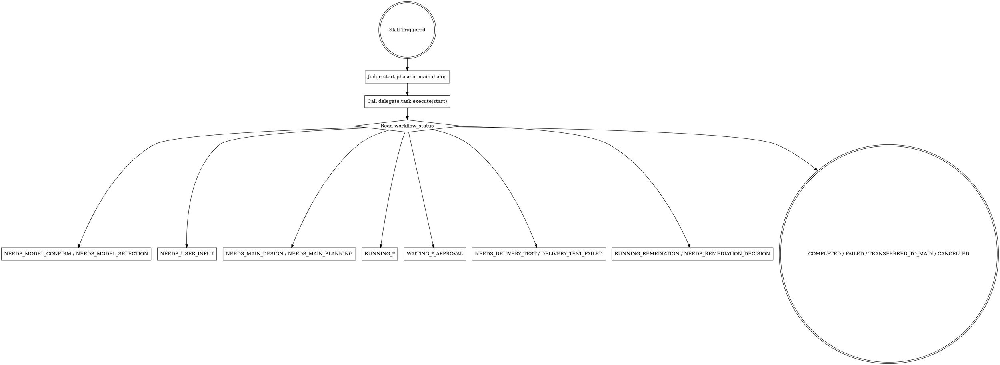

# Team Delegate

将委派流程交给插件状态机。模型只负责理解需求与对话；流程推进由 `delegate.task.execute` 驱动。

<HARD-GATE>
在进入委派编码前，必须先完成“主对话阶段判定 + 开发类型判定 -> start 入场”闭环。禁止做以下动作：
1. 未完成阶段判定和开发类型判定就直接调用 `delegate.task.execute(action=start)`。
2. 在 `start` 返回前先创建分支、先改代码、先运行实现命令（编译/测试/截图/启动客户端）。
3. 调用 `delegate.session.*` / `delegate.turn.*` 低层工具绕过高层入口。
4. 在 `start` 返回后不按 `workflow_status` / `next_action_required` 推进，私自跳步骤。
</HARD-GATE>

<PHASE-JUDGEMENT-FIRST>
触发本技能后：
1. 先在主对话内基于上下文判定业务阶段：方案制定（`design`）/ 计划制定（`planning`）/ 计划实施（`implementation`）/ 需要补充上下文（`need_user_input`）。
2. 同时在主对话内基于上下文判定开发类型：新增功能或业务流程调整（`feature`）/ BUG 修改（`bugfix`）/ 需要补充上下文（`need_user_input`）。
3. 阶段判定结果必须随 `start_phase` 传入 `delegate.task.execute(action=start)`。
4. 开发类型判定结果必须随 `development_type` 传入 `delegate.task.execute(action=start)`。
5. 若主对话无法明确判定阶段或开发类型，必须使用对应的 `need_user_input` 并填写 `missing_context`，由用户补充后重试。
6. 禁止在插件内部通过关键词穷举判断开发类型；自然语言理解由主会话完成，插件只根据 `development_type` 选择文档规则。
</PHASE-JUDGEMENT-FIRST>

<BUSINESS-FIRST-OUTPUT>
所有面向用户的输出必须业务导向。

1. 先说明当前业务阶段、判断依据和下一步业务动作。
2. 禁止把 `workflow_status` / `current_stage` / `next_action_required` 作为用户首屏主提示。
3. 内部状态字段只用于决定下一步工具调用；除非用户明确要求调试，否则不要主动展示。
4. 用户看到的模型选择提示必须类似：“当前已经有了方案和计划，按约定可以直接进入计划实施阶段。请为本次计划实施选择执行模型。”
5. 不要使用“委派实现模型”“MCP 工具”“内部参数”等开发者视角表达作为主提示。
6. 实施阶段必须使用“持续跟进”“暂无新的可汇报进展”“超过约定时间仍无进展”等业务表达；禁止向用户使用开发导向的进度查看表达。
</BUSINESS-FIRST-OUTPUT>

## 触发条件

用户出现以下任一语义时触发（必须是“明确委派语义”）：

1. 明确说“委派/分派/team-delegate/team mode/delegation”，要求由插件编排。
2. 明确说“Design -> Planning -> Implementation”流程要走闭环并等待审批。
3. 明确说“不想手填 API 参数，由插件自动编排”。
4. 明确说“继续某个已委派会话并整改”。
5. "delegate this task / use delegation workflow / team-delegate"
6. "run design -> planning -> implementation with approval gates"
7. "continue previous delegated session with rework"
8. "do not make me fill API params manually; orchestrate by plugin"

兼容别名：

1. `team-delegation-autopilot`

## 铁律

1. **先主对话判定阶段和开发类型，再 start。** `start` 必须携带 `start_phase` 和 `development_type`。
2. **插件管流程，模型不越级。** 模型不得跳过插件直接进入本地实现。
3. **阶段和开发类型判定由主对话模型完成，插件只编排。** 插件不替代主对话做阶段决策，也不通过关键词穷举猜开发类型。
4. **模棱两可即不满足。** 当主对话无法明确判定阶段或开发类型时，必须使用 `need_user_input`，禁止猜测。
5. **开发类型决定文档规则。** `feature` 使用新增功能设计和计划指南；`bugfix` 使用 BUG 修改设计和计划指南。BUG 修改必须使用 BUG 修改设计和计划指南。
6. **只有计划实施阶段才需要选择 ACP 执行模型。** 方案制定、计划制定默认由主会话执行，不触发模型选择；只有用户明确选择 ACP 执行方案/计划时才需要模型。
7. **一切推进看返回状态，但对用户表达必须看业务语义。** 下一步只允许执行 `next_action_required` 里的动作；对用户说明时优先使用 `business_stage` / `user_message` / `next_business_action`。
8. **不要主动传短超时。** 正常业务流程不要传 `timeout_ms`；除非用户明确要求限制等待时间，否则让插件使用安装时配置的长轮次超时。
9. **实施阶段必须满足 1-2 分钟持续跟进节奏。** 这个节奏是硬性流程要求，不是可选项；未到下一次持续跟进时间，禁止提前向用户输出暂无进展。
10. **实施完成不等于交付完成。** 计划实施完成后必须进入真实业务交付测试；只有交付测试通过后，才能向用户声明完成。
11. **交付测试失败必须闭环整改。** 失败后必须提交失败材料，形成整改方案和整改计划，确认后整改实施，并回到同一条业务交付测试链路。
12. **ACP 整改次数固定为 3 次。** 整改次数由插件状态机控制，不能由 LLM 或调用参数决定；完成 3 次整改后仍未通过，只能由主会话接手整改或取消后续工作。
13. **插件没有给继续等待选项时必须停步。** 如果 `next_action_required` 不包含 `continue_wait`，必须停止持续跟进，输出 `user_message` 和 `next_business_action`，等待用户选择插件给出的下一步。

## 执行流程



## 状态处理规则

### 1) `NEEDS_MODEL_CONFIRM` / `NEEDS_MODEL_SELECTION`

0. 只有计划实施阶段默认会进入模型选择；方案制定/计划制定默认主会话执行，不要要求用户选择模型。
1. `NEEDS_MODEL_CONFIRM`：用业务语言说明为什么现在需要模型，再给用户二选一（默认 1）
   - `1` `model_confirm` + `model_confirm_choice=use_saved_model`
   - `2` `model_confirm` + `model_confirm_choice=select_new_model`
2. `NEEDS_MODEL_SELECTION`：用 `user_message` 或同义业务表达提示用户选择本次计划实施模型，展示 `available_models`，由用户选一个后调用 `model_select` 并传 `selected_model`。
3. 完成模型确认/选择后才可进入下一阶段。

### 2) `NEEDS_USER_INPUT`

1. 仅要求用户补充上下文（文档内容或文档路径）。
2. 不进入本地开发。
3. 补充后重新 `action=start`。

### 3) `NEEDS_MAIN_DESIGN` / `NEEDS_MAIN_PLANNING`

1. 先明确说明当前处于方案制定或计划制定阶段，按约定由主会话执行，不需要选择 ACP 模型。
2. 只给用户两项明确选择（默认 1）：
   - `1` 主会话执行（默认）
   - `2` ACP 委派执行（重新 `action=start` 且传 `design_planning_executor=acp`）
3. 在用户选择前，不做任何本地实现动作。

### 4) `RUNNING_DESIGN` / `RUNNING_PLANNING` / `RUNNING_IMPLEMENTATION`

1. 先遵循同步窗口（由插件内部处理）。
2. 然后必须按 `follow_up_policy.next_follow_up_at` 持续跟进；间隔必须落在 `follow_up_policy.interval_min_seconds` 到 `follow_up_policy.interval_max_seconds` 之间，当前要求是 1-2 分钟。
3. 每次 `status` 返回后，先看 `progress_update.has_new_output`：
   - 若为 `true`，用中文向用户输出一段简短进展总结，不粘贴完整原始过程。
   - 若为 `true`，继续等待，不询问是否接手。
   - 若为 `false` 且尚未进入 `NEEDS_USER_DECISION`，不得向用户输出暂无进展；继续按下一次持续跟进时间等待。
4. 只有 ACP 超过 `follow_up_policy.no_progress_decision_seconds` 仍无新进展后进入 `NEEDS_USER_DECISION`，才给二选一：
   - `continue_wait`
   - `handoff_to_main`
5. 用户选择 `continue_wait` 后，进入新的持续跟进周期；等待过程中只要 ACP 又输出内容，就恢复进展总结并清空旧的接手询问。
6. 如果 `NEEDS_USER_DECISION` 返回后，`next_action_required` 里没有 `continue_wait`，代表当前任务已经不能继续等待；必须停止持续跟进，禁止继续调用 `status`，并立刻输出 `user_message`，让用户选择插件给出的下一步。

### 5) `WAITING_DESIGN_APPROVAL`

1. 用户反馈 -> `design_feedback`
2. 用户批准 -> `design_approve`

### 6) `WAITING_PLAN_APPROVAL`

1. 用户反馈 -> `planning_feedback`
2. 用户批准 -> `planning_approve`
3. `planning_approve` 后只代表进入计划实施；实施完成后仍必须等待真实业务交付测试。

### 7) `NEEDS_DELIVERY_TEST`

1. 先告诉用户：计划实施已经完成，但还不能判定交付完成。
2. 主会话必须从真实业务入口执行交付测试。
3. 测试通过调用 `delivery_test_pass`，可在 `feedback_text` 中记录通过材料。
4. 测试失败调用 `delivery_test_fail`，必须在 `feedback_text` 中提供失败位置、用户输入、实际表现、预期表现、复现步骤。
5. 不允许用单元测试、字段检查或 ACP 自述完成代替真实业务交付测试。

### 8) `DELIVERY_TEST_FAILED`

1. 向用户展示整改方案和整改计划。
2. 用户确认后调用 `remediation_approve`。
3. 用户不希望 ACP 继续当前轮整改时调用 `handoff_to_main`，由主会话接手。

### 9) `RUNNING_REMEDIATION`

继续按 1-2 分钟节奏持续跟进整改进展；整改完成后必须重新执行同一条交付测试链路。

### 10) `NEEDS_REMEDIATION_DECISION`

1. 该状态只会在完成 3 次 ACP 整改后仍未通过交付测试时出现。
2. 必须告诉用户：后续不能继续由 ACP 自动整改。
3. 只给两个选择：
   - `handoff_to_main`：主会话接手整改。
   - `cancel_follow_up`：取消后续工作，本次任务不声明交付完成。

### 11) 终态

1. `COMPLETED`：汇报完成与产出。
2. `FAILED`：报告错误并给出下一步可执行动作（通常 `status` 或重启流程）。
3. `TRANSFERRED_TO_MAIN`：确认已取消并关闭 ACP 会话，回到主会话处理。
4. `CANCELLED`：确认用户取消后续工作，并明确本次任务未通过交付测试，不能声明交付完成。

## 必用调用模板

除非用户明确要求短超时，以下调用都不得添加 `timeout_ms`。

首次入口（必须）：

```json
{
  "workspace_path": "<当前工作目录>",
  "requirement_text": "<用户原始需求>",
  "session_alias": "<任务别名>",
  "action": "start",
  "start_phase": "<design|planning|implementation|need_user_input>",
  "start_phase_reason": "<主对话判定理由，可选>",
  "start_phase_evidence": ["<判定证据，可选>"],
  "development_type": "<feature|bugfix|need_user_input>",
  "development_type_reason": "<主对话判定开发类型的理由，可选>",
  "development_type_evidence": ["<开发类型判定证据，可选>"],
  "missing_context": ["<仅 need_user_input 时填写，可选>"],
  "acceptance_criteria": "<验收标准，可选>",
  "auto_close": true
}
```

模型确认（历史模型可用时）：

```json
{
  "workspace_path": "<当前工作目录>",
  "requirement_text": "<用户原始需求>",
  "session_alias": "<任务别名>",
  "action": "model_confirm",
  "model_confirm_choice": "use_saved_model"
}
```

模型重选（无历史模型或用户改选）：

```json
{
  "workspace_path": "<当前工作目录>",
  "requirement_text": "<用户原始需求>",
  "session_alias": "<任务别名>",
  "action": "model_select",
  "selected_model": "<provider/model>"
}
```

用户选 ACP 执行 Design/Planning 时：

```json
{
  "workspace_path": "<当前工作目录>",
  "requirement_text": "<用户原始需求>",
  "session_alias": "<同一任务别名>",
  "action": "start",
  "development_type": "<feature|bugfix|need_user_input>",
  "design_planning_executor": "acp"
}
```

## 红旗（出现即停止并回到流程）

若模型产生以下想法，立即停止并回到“调用 `delegate.task.execute` -> 看状态”：

1. “我先看代码再说”
2. “我先给你一个方案确认”
3. “我先改一点再走插件”
4. “先手动调低层 API 更快”
5. “我先做 memory/搜索/扫描再 start”

## 输出要求

每次对用户回报必须包含业务信息：

1. 当前业务阶段，例如：方案制定、计划制定、计划实施、等待实施进展、需要补充上下文。
2. 阶段判断依据：从用户上下文中看到了什么，例如已有方案、已有计划、用户确认可实施。
3. 下一步业务动作：主会话制定方案、主会话制定计划、选择计划实施模型、等待实施结果、补充上下文等。
4. 用户需要做的唯一选择（若有）。

禁止把 `workflow_status` / `current_stage` / `next_action_required` 放在面向用户输出的开头或作为主提示。只有用户要求调试、排障或查看内部状态时，才可以在业务说明之后补充这些字段。

如果 next_action_required 不包含 continue_wait，必须停止持续跟进，输出 user_message，并等待用户选择插件返回的业务动作。

## 继续已委派任务

当用户说“继续某个已委派任务”“继续某个任务名”“我选择继续等待”时：

1. 必须复用用户给出的任务名作为 `session_alias`。
2. 如果用户明确选择继续等待，优先调用 `action=continue_wait`。
3. 如果用户只是询问当前进展，调用 `action=status`。
4. 禁止把继续任务当成新任务重新 `start`，除非插件明确返回找不到流程，且用户确认要重新开始。
5. 如果误调用 `start` 后插件返回已有流程状态，必须按该状态继续，不得再次要求选择模型。
